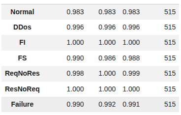
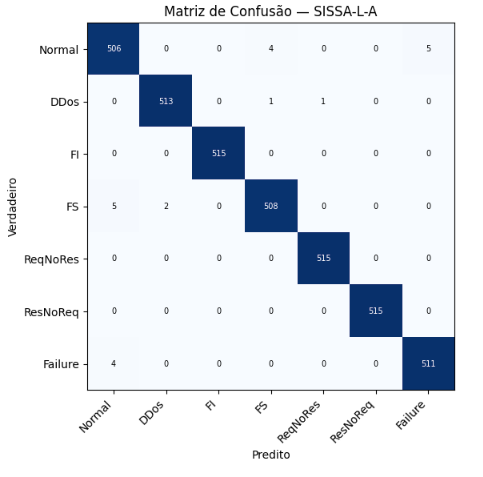
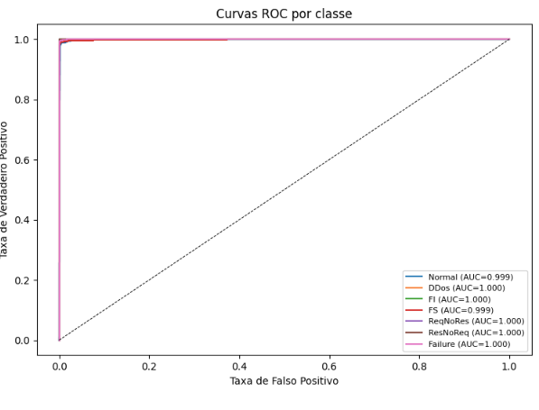

# Relatório de Experimento — Reprodução do SISSA (Liu et al., 2024)

**Trabalho original:** Q. Liu, X. Li, K. Sun, Y. Li, Y. Liu. *SISSA: Real-Time Monitoring of
Hardware Functional Safety and Cybersecurity With In-Vehicle SOME/IP Ethernet Traffic.*
IEEE Internet of Things Journal, 11(16):27322–27335, 2024.
**Execução:** Google Colab, GPU NVIDIA Tesla T4 (junho/2026).
**Notebook:** [`notebooks/SISSA_Colab.ipynb`](../notebooks/SISSA_Colab.ipynb)

---

## 1. Contexto

O SISSA é o trabalho mais abrangente entre os analisados: monitora, num **único modelo**, tanto
**cibersegurança** (DDoS, MITM) quanto **safety** (falha de hardware de ECU, modelada por
distribuição de Weibull). É um classificador de **7 classes** — *Normal, DDoS, FI (Fake
Interface), FS (Fake Source), ReqNoRes (requisição sem resposta), ResNoReq (resposta sem
requisição), Failure (falha de hardware)* — sobre janelas de **128 pacotes × 25 atributos**.

Compara três *backbones* (CNN, RNN, **LSTM**), com e sem **autoatenção residual (RSAB)**. O
modelo recomendado pelos autores é o **SISSA-L-A** (LSTM + atenção), que o artigo reporta com
**99,7%** de acurácia de validação. O SISSA **publica código e dados**, então rodamos a
implementação dos autores com a **janela completa de 128 pacotes**, por 200 épocas, na GPU.

---

## 2. Resultados

| Modelo | Test acc | Tempo de inferência |
|--------|---------:|--------------------:|
| **SISSA-L-A** (LSTM + atenção) | **99,39%** | ~4,5 ms/janela |
| **SISSA-L** (LSTM puro) | **99,39%** | ~4,0 ms/janela |

Métricas por classe (SISSA-L-A) — Precisão / Recall / F1:

| Classe | F1 |
|--------|---:|
| Normal | 0,983 |
| DDoS | 0,996 |
| FI | **1,000** |
| FS | 0,988 |
| ReqNoRes | 0,999 |
| ResNoReq | **1,000** |
| Failure (safety) | 0,991 |

Matriz de confusão e curvas ROC:

A matriz é **quase perfeitamente diagonal** — as únicas confusões relevantes são *Normal ↔ FS*
(poucos casos) e *Failure → Normal* (4 casos). As curvas ROC têm **AUC ≈ 1** para todas as 7
classes.

---

## 3. Interpretação

- **O SISSA reproduz o artigo**: **99,39%** de acurácia (artigo: 99,7%), com **todas as 7
  classes** apresentando F1 entre **0,98 e 1,00** — incluindo a classe de *safety* (*Failure*,
  F1 0,991) e as anomalias de comunicação (*ReqNoRes*/*ResNoReq* ~1,00). É a reprodução de
  melhor desempenho entre os quatro trabalhos.
- **A janela de 128 pacotes foi decisiva:** em CPU com janela 64 havíamos chegado a 94,1%; com a
  janela completa na GPU, atingiu-se 99,4%. Isso confirma a importância do **contexto temporal**
  para os modelos sequenciais.
- **⚠️ A autoatenção (RSAB) — contribuição técnica do artigo — quase não ajudou:** o **SISSA-L
  (LSTM puro) empata com o SISSA-L-A** (ambos 99,39%). Ou seja, o ganho atribuído à atenção
  **não se confirma** neste dataset; o LSTM sozinho já satura o desempenho.
- **Ressalva de produção:** o dataset é **balanceado por construção** (515 amostras por classe),
  o que é **irrealista** — em tráfego real, fortemente desbalanceado, a detecção das classes
  minoritárias seria mais difícil e a acurácia global cairia. A reavaliação sob desbalanceamento
  realista é um passo necessário antes de conclusões sobre prontidão.
- **Conclusão:** trabalho **plenamente reprodutível** e o mais robusto do conjunto; a ressalva é
  metodológica (avaliação balanceada) e quanto ao real valor da autoatenção.
